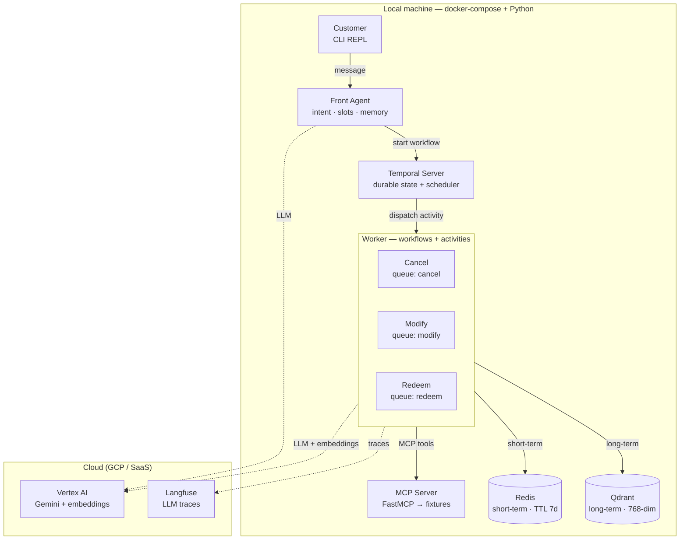
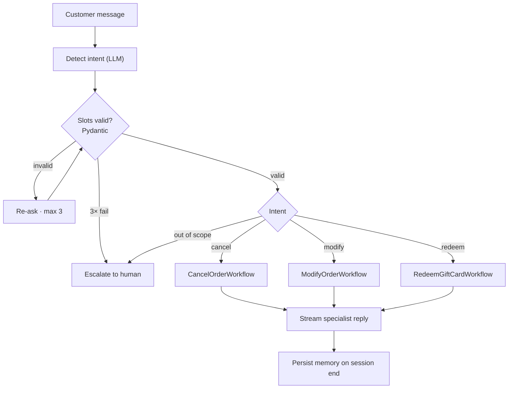
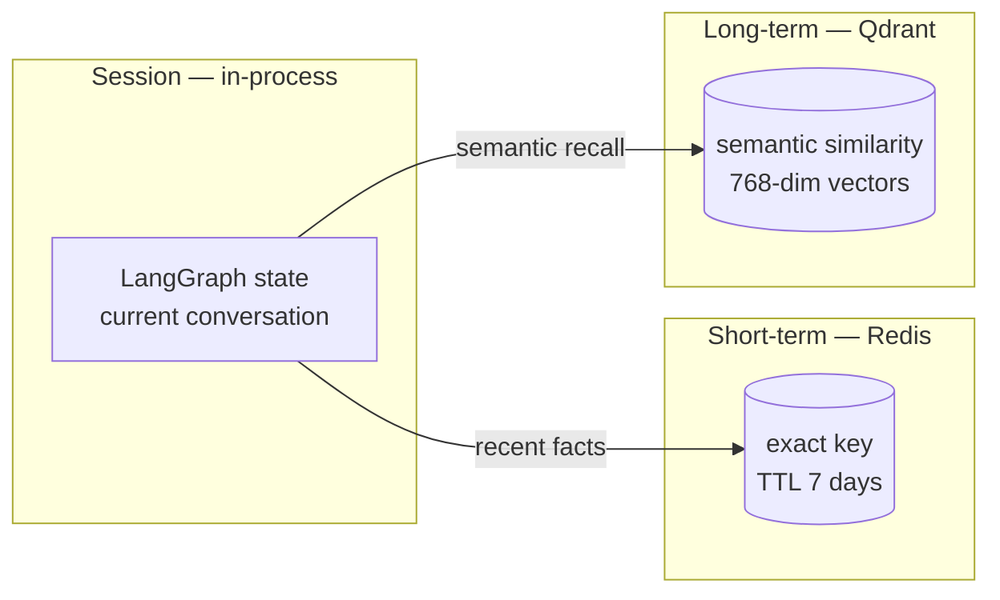

# Agentic CX — Multi-Agent Spike

> **Personal proof-of-concept.** Being prepared for open source.

A local-first **multi-agent customer-service system**. A LangGraph **Front Agent** detects
intent, fills and validates slots, and dispatches to one of three **specialist agents**
(cancel order / modify order / redeem gift card) through durable **Temporal workflows**.
Specialists call client-API tools over a real **MCP** server and read/write a **three-layer
memory**. Every LLM step is traced in **Langfuse**.

The whole system runs on a laptop — docker-compose plus a couple of Python processes. The
only cloud dependencies are **Vertex AI** (LLM + embeddings) and **Langfuse Cloud**.

## Why I built it

To prove the parts that actually matter for production agents: **multi-agent orchestration**,
**durability**, **layered memory**, and **observability** — without hiding behind managed
services. It's deliberately local-first so the interesting failure modes (a crashing worker,
memory shared across processes) are visible and demonstrable.

## Architecture

## The three-process model

The single most important idea in this spike: there are **three kinds of running process**
with very different jobs. The Temporal *server* stores durable state and schedules work — it
does **not** run the orchestration logic. The plan lives in **workflow code inside the
worker**; the non-deterministic LLM work runs in **activities**.

| Process | Role | Runs our logic? |
|---|---|---|
| **Temporal Server** (container) | Durable state store + scheduler; persists every workflow's history, drives retries/timeouts | infra only |
| **Front Agent** (Python) | Greeting, intent detection, slot filling + validation; a Temporal *client* that starts workflows | yes |
| **Worker** (Python) | Runs the deterministic workflow plans **and** the LangGraph specialists as activities | yes |

> Why LLM calls live in **activities**: Temporal replays workflow code and requires
> determinism, so the non-deterministic agent runs in an activity. Kill the worker
> mid-workflow and Temporal resumes it on restart — a plain async function would have lost
> that state.

## Conversation flow

## Three-layer memory

Session memory is in-process (LangGraph state); short- and long-term memory are
**externalised databases** precisely so the Front Agent and Worker processes see the same
data. Long-term recall is what lets the agent greet a returning customer with context from a
previous conversation.

## What makes it interesting

- **Durable orchestration** — Temporal workflows survive worker crashes and resume exactly
  where they stopped; the Temporal Web UI shows workflow history live.
- **Microservices-ready monolith** — each specialist runs on its own Temporal task queue.
  Going from one process to many is a deployment change, not a rewrite.
- **Real MCP protocol** — a FastMCP server wraps in-process fixtures, so the tool layer is a
  genuine, demonstrable MCP integration at near-zero infra cost.
- **Dual observability** — Langfuse for the LLM plane, the Temporal UI for the orchestration
  plane, both shown live.

## Stack

`LangGraph` · `Temporal` · `FastMCP` · `Redis` · `Qdrant` · `Vertex AI (Gemini)` ·
`text-embedding-004` · `Langfuse` · `docker-compose` · `uv` · `Python 3.12`
