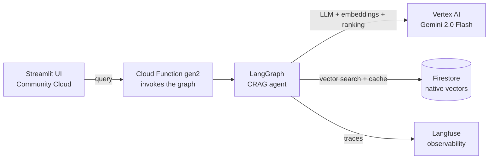
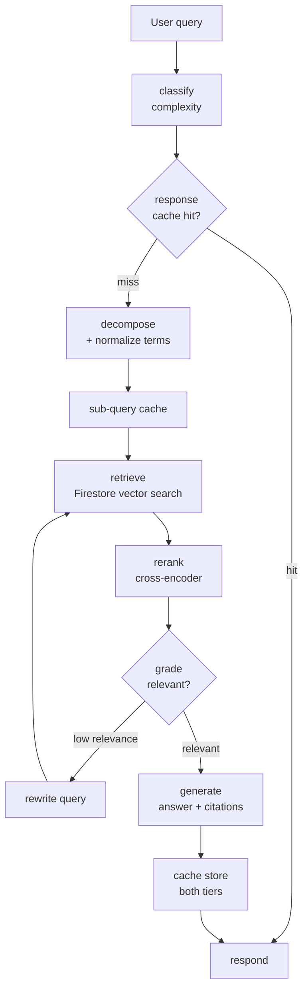

# MedRAG — Clinical Guidelines Assistant

> **Personal proof-of-concept.** Being prepared for open source.

A stateful agentic system that answers clinical questions over the **StatPearls** medical
corpus using **Corrective RAG (CRAG)**, orchestrated by **LangGraph**. It leans on two-tier
semantic caching, cross-encoder reranking, adaptive retrieval, and query decomposition with
medical-term normalization, and it runs fully serverless on GCP.

## Why I built it

I wanted to take a RAG system past the demo stage. In practice that means three things I
usually see skipped: grading the retrieved context and self-correcting when it is weak,
keeping cost down with caching and adaptive retrieval, and making the whole thing observable.
Medicine is unforgiving about hallucination, so it is a good place to stress-test grounding.

## Architecture

Everything is serverless — no always-on instances. The LangGraph agent runs inside a Cloud
Function, retrieval and caching live in Firestore's native vector search, and every step is
traced in Langfuse.

## The CRAG agent graph

The core is a LangGraph state machine. It short-circuits on a cached full response,
decomposes and normalizes the query, retrieves and reranks, then **grades relevance** — and
rewrites-and-retries when the context isn't good enough before generating a cited answer.

## What makes it interesting

- **Corrective RAG loop** — a `grade` node scores retrieved documents; below a threshold the
  agent rewrites the query and re-retrieves (bounded by a retry budget) instead of answering
  from weak context.
- **Two-tier semantic cache** — a full-response cache and a sub-query document cache, both
  keyed by embedding similarity. Medical-term normalization ("shortness of breath" →
  "dyspnea") makes cache hits far more likely.
- **Adaptive retrieval** — a classifier labels each query `simple` / `moderate` / `complex`
  and rewrites the pipeline config on the fly (top-k, reranking, retry budget).
- **Serverless economics** — Firestore vector search, Vertex AI Ranking API, and Cloud
  Functions mean zero idle cost and a generous free tier.

## Stack

`LangGraph` · `Vertex AI (Gemini 2.0 Flash)` · `Firestore vector search` ·
`Vertex AI Ranking API` · `Cloud Functions gen2` · `Langfuse` · `Streamlit` · `uv` · `Python 3.12`

## Corpus

StatPearls via HuggingFace (`MedRAG/statpearls`) — pre-chunked, CC-BY 4.0, ~180K passages.
